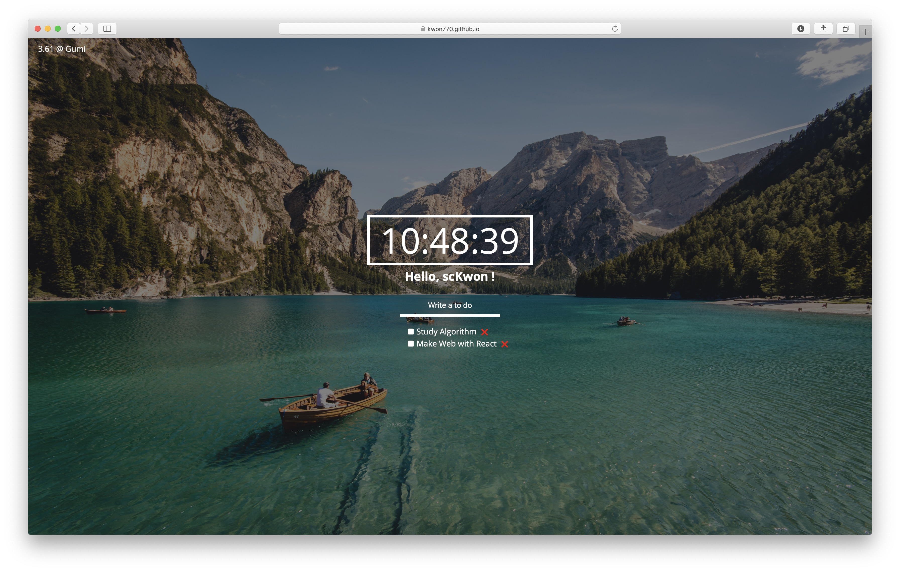

# Web with VanillaJS | HTML & CSS & VanillaJS

## [HERE IS LINK !](https://kwon770.github.io/WebService-with-VanliaJs/)

|       Default Screen       |
| :------------------------: |
|  |

|       Screen in use        |
| :------------------------: |
|  |

## Features
- Remember name and toDo - store data in localStorage
- Show location and weather - get location data and display weather using [openWeather-Api](https://openweathermap.org)
- Display random landscape image - display cool images at background randomly using [Unsplash](https://unsplash.com)
